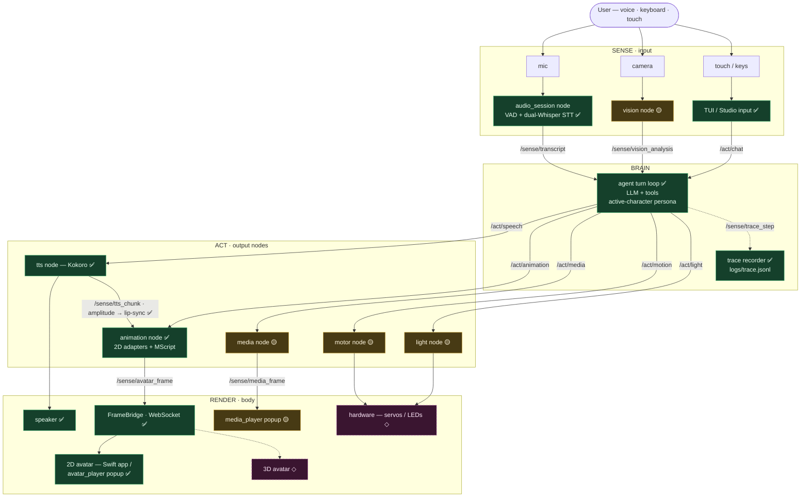

# JROS — full-stack pipeline infographics

End-to-end layouts of everything JROS touches: the sense → brain → act loop,
the avatar systems, voice in/out, hardware, and user input. Diagrams are
**Mermaid in markdown** — they render as visuals in GitHub / VS Code / the
[mermaid.live](https://mermaid.live) editor, and the source stays diffable.
(Any diagram can also be exported to PNG/SVG if a flat image is wanted.)

**Status legend:** ✅ built · 🟡 partial / in progress · ◇ planned (to build)

---

## Master loop — end to end

Everything rides the **transport bus** (`InProcBus` today, `ZmqBus` for
multi-machine). Topics: `/sense/*` (inputs), `/act/*` (commands).

---

## Pipelines (each gets its own detail diagram)

| Pipeline | Status | Detail diagram |
|---|---|---|
| Voice in · ASR (mic → VAD → STT → transcript) | ✅ built | `voice_in_asr.md` ◇ |
| STT → LLM → TTS (the conversation loop) | ✅ built | `stt_llm_tts.md` ◇ |
| 2D avatar (animation node → frames → renderer) | ✅ built | `avatar_2d.md` ◇ |
| Lip-sync (`/sense/tts_chunk` amplitude → mouth) | ✅ built | `lip_sync.md` ◇ |
| 3D avatar | ◇ planned | `avatar_3d.md` ◇ |
| Media (media node → frames → player) | 🟡 in progress | `media.md` ◇ |
| Hardware integration (motor / light / sensors) | 🟡 partial | `hardware.md` ◇ |
| User input (voice / keyboard / Studio / touch) | ✅ built | `user_input.md` ◇ |
| Observability (trace → baseline) | ✅ built | `observability.md` ◇ |

◇ = diagram not written yet. The statuses above are a first-pass read; each
detail diagram verifies the exact wiring against the code before it's marked.
