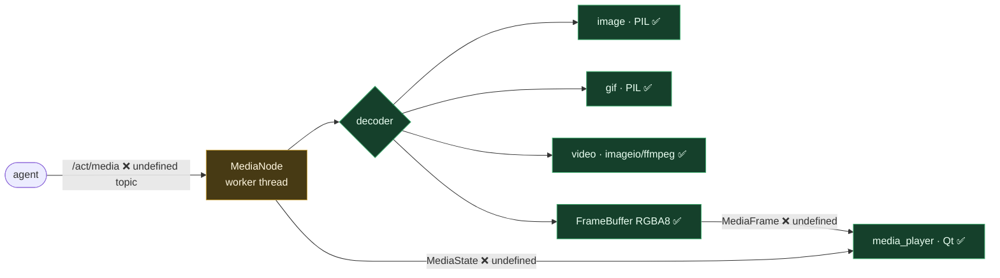

# Media — media node → frames → player

**Status: 🟡 partial** — decoders + the Qt player are built, but the node's bus contract is missing (it references undefined topics), so it can't run yet.

**Flow (intended).** The agent publishes `/act/media` → `MediaNode` decodes the asset (image / gif / video) on a worker thread → emits `FrameBuffer`s → the `media_player` Qt window renders.

**The gap (code-verified).** `MediaNode` calls `topics.ACT_MEDIA`, `topics.MediaFrame`, `topics.MediaState` — **none of these are defined** in `transport/topics.py`. So booting the node (e.g. via `NodeHarness`) raises `AttributeError` in `setup()`/publish. The **decoders and the Qt renderer are fully built**; only the bus contract is missing. (This is exactly the kind of thing the "import under development, vet in isolation" plan is meant to catch.)

**To finish:** add `ACT_MEDIA` + `MediaFrame` + `MediaState` topic structs to `transport/topics.py` (mirror the animation node's `AnimationCommand`/frame pattern), then vet end-to-end with `NodeHarness`.

**Key files:** `nodes/media/node.py` · `nodes/media/decoders/*` · `nodes/media/frames.py` · `interfaces/media_player/window.py`.
